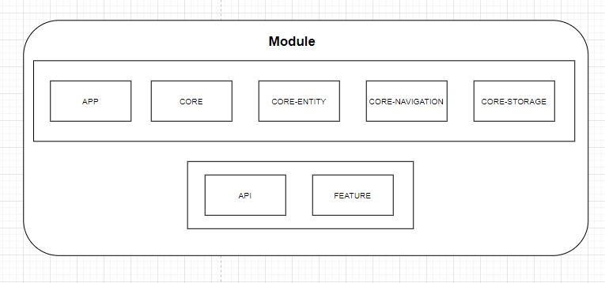
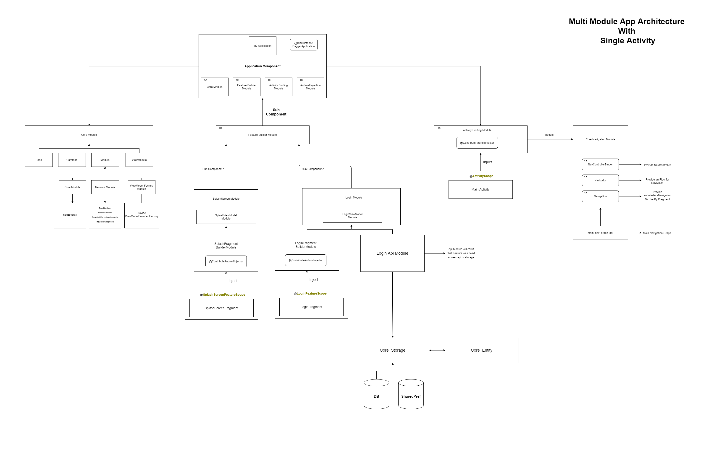
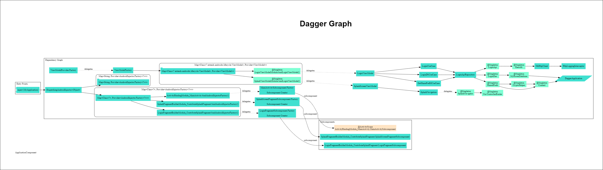

## Multi Module App Architecture With Single Activity

The goal of the project is to demonstrate multi module architecture with my own learning about this Multi Module App , This Project still use Clean Architecture Component As Base of this architecture component

## Architecture

The architecture of the application is based, apply and strictly complies with each of the following 5 points:

-   A single-activity architecture, using the [Navigation component](https://developer.android.com/guide/navigation/navigation-getting-started) to manage fragment operations.
-   [Android architecture components](https://developer.android.com/topic/libraries/architecture/), part of Android Jetpack for give to project a robust design, testable and maintainable.
-   Pattern [Model-View-ViewModel](https://en.wikipedia.org/wiki/Model%E2%80%93view%E2%80%93viewmodel) (MVVM) facilitating a [separation](https://en.wikipedia.org/wiki/Separation_of_concerns) of development of the graphical user interface.
-   [S.O.L.I.D](https://en.wikipedia.org/wiki/SOLID) design principles intended to make software designs more understandable, flexible and maintainable.
-   [Modular app architecture](https://proandroiddev.com/build-a-modular-android-app-architecture-25342d99de82) allows to be developed features in isolation, independently from other features.

### Reason Why Choose Multi Module

1. Easy to maintance
2. When Project grow big develop some feature will be easy to handle
3. More Individual feature make some detail delivered , example Unit Test
4. Time Running Excetion more fast

### Reason Why Choose Single Activity

1. Navigation was recomendation to Single Activity
2. Navigation more Simple dan more clean than start activity
3. Navigation more easy to see and easy to understand
4. Navigation Drawer and Toolbar easy to manage for Single activity.
5. Context Can use anywhere

So that my reason to choose this architecture, what about you? if you can give any feedback will be pleasure to me 
so let continue ->

### Modules
Modules are collection of source files and build settings that allow you to divide a project into discrete units of functionality. In this case apart from dividing by functionality/responsibility, existing the following dependence between them:

 

The above graph shows the app modularisation:

-   `:app` this is the main entry of this application
-   `:core` will provide main functionality of this project example network and common others
-   `:core-entity` will provide the all entity 
-   `:core-navigation` will provide the core of navigation, main navigation graph will be created in here 
-   `:core-storage` will provide database and shared preference
-   `:api` will provide call network request or storage request, this module will 1 on 1 with core-storage
-   `:features` this is place feature was created

### [Design Architecture](https://drive.google.com/file/d/1-CjV67drwM1VndNJ-_k-1OUEAK13ct2c/view?usp=sharing)

 

### [Dagger Graph](https://drive.google.com/file/d/1-CjV67drwM1VndNJ-_k-1OUEAK13ct2c/view?usp=sharing)

 

## Tech-stack

### Dependencies

-   [Jetpack](https://developer.android.com/jetpack):
    -   [Android KTX](https://developer.android.com/kotlin/ktx.html) - provide concise, idiomatic Kotlin to Jetpack and Android platform APIs.
    -   [AndroidX](https://developer.android.com/jetpack/androidx) - major improvement to the original Android [Support Library](https://developer.android.com/topic/libraries/support-library/index), which is no longer maintained.
    -   [Lifecycle](https://developer.android.com/topic/libraries/architecture/lifecycle) - perform actions in response to a change in the lifecycle status of another component, such as activities and fragments.
    -   [LiveData](https://developer.android.com/topic/libraries/architecture/livedata) - lifecycle-aware, meaning it respects the lifecycle of other app components, such as activities, fragments, or services.
    -   [Navigation](https://developer.android.com/guide/navigation/) - helps you implement navigation, from simple button clicks to more complex patterns, such as app bars and the navigation drawer.
    -   [Room](https://developer.android.com/topic/libraries/architecture/room) - persistence library provides an abstraction layer over SQLite to allow for more robust database access while harnessing the full power of SQLite.
    -   [ViewModel](https://developer.android.com/topic/libraries/architecture/viewmodel) - designed to store and manage UI-related data in a lifecycle conscious way. The ViewModel class allows data to survive configuration changes such as screen rotations.
    -   [Coroutines](https://kotlinlang.org/docs/reference/coroutines-overview.html) - managing background threads with simplified code and reducing needs for callbacks.
    -   [Dagger2](https://dagger.dev/) - dependency injector for replacement all FactoryFactory classes.
    -   [Retrofit](https://square.github.io/retrofit/) - type-safe HTTP client.
    -   [Stetho](http://facebook.github.io/stetho/) - debug bridge for applications via Chrome Developer Tools.

